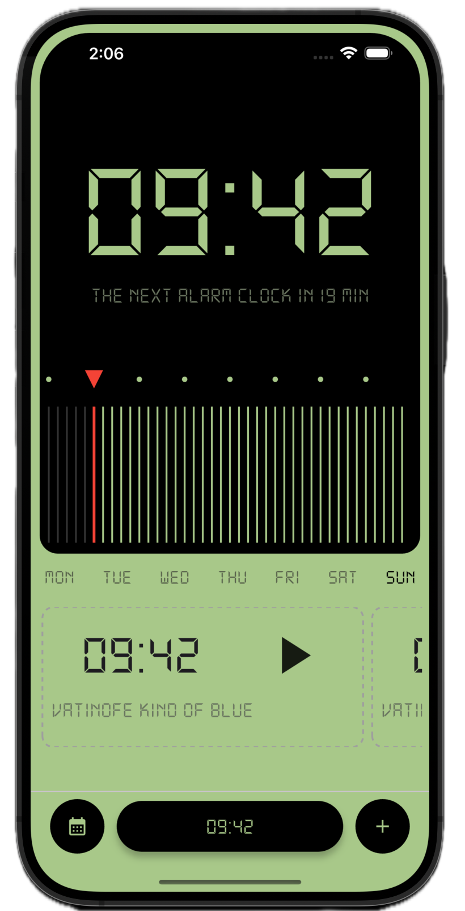
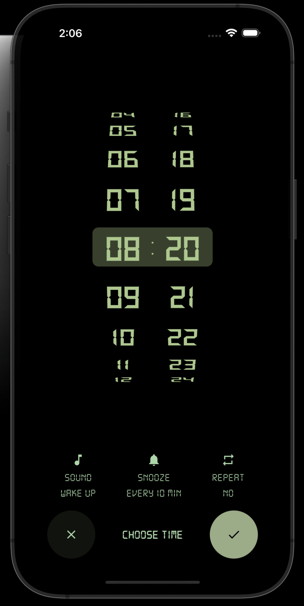

# Minimalist Alarm Clock

A sleek, minimalist alarm clock application built with Flutter, featuring a dark theme with elegant mint green accents.

### Original design inspiration from Dribbble: [Design Link](https://dribbble.com/shots/25347673-Alarm)
